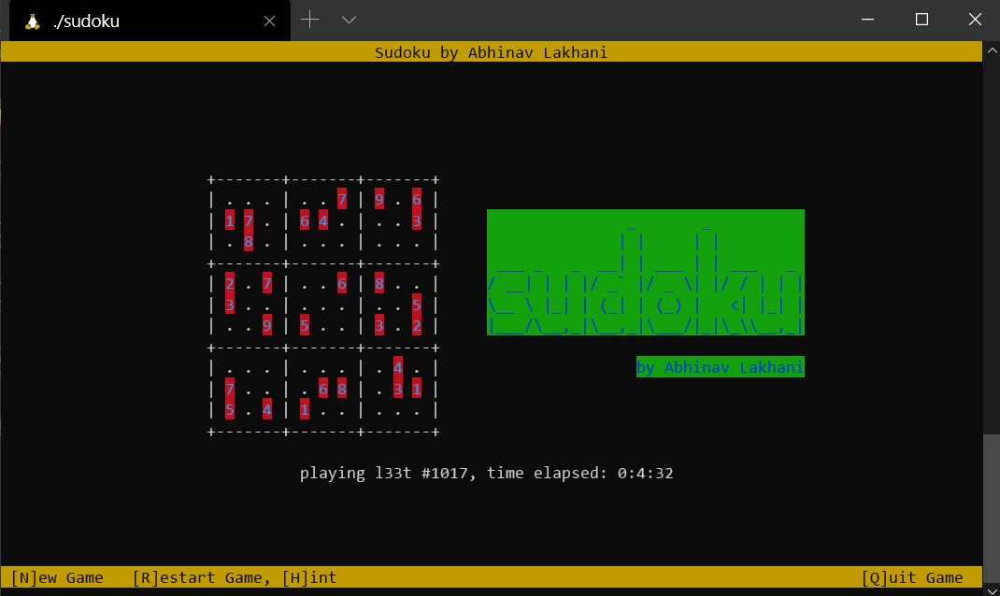
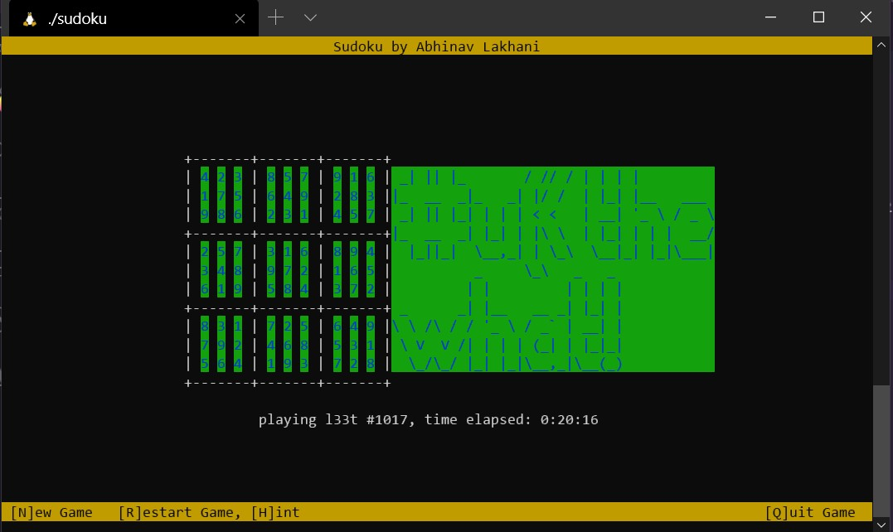

# Sudoku

A command-line version of the classic game sudoku.

just run below command in your terminal

```cmd
./sudoku <level> <!optopnal num> # replace <level> with l33t or n00b and <!optional> with a number from 1-1024
```


